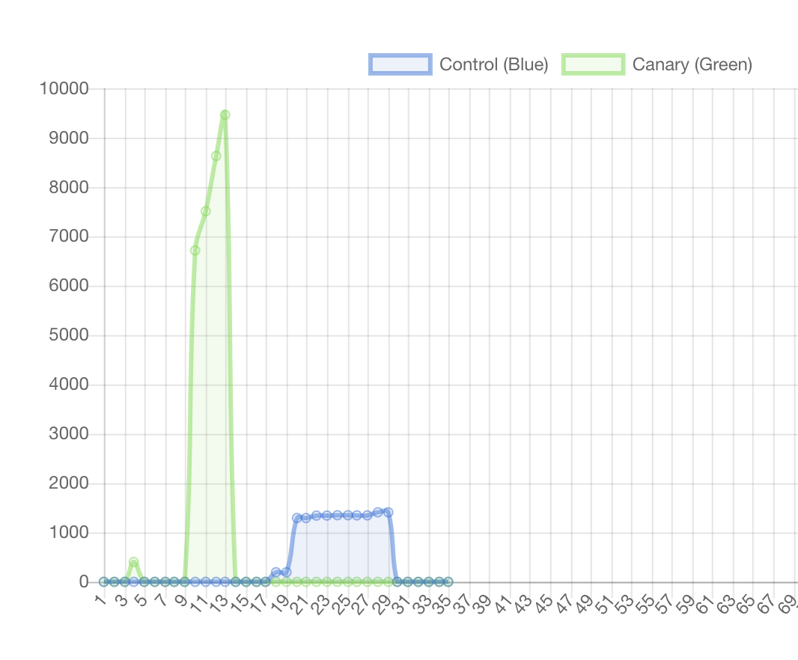
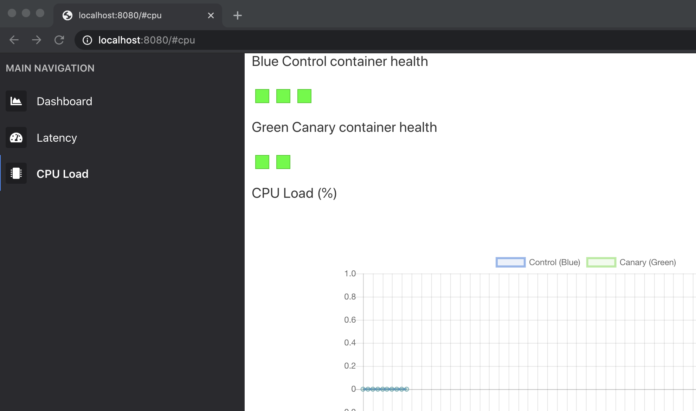
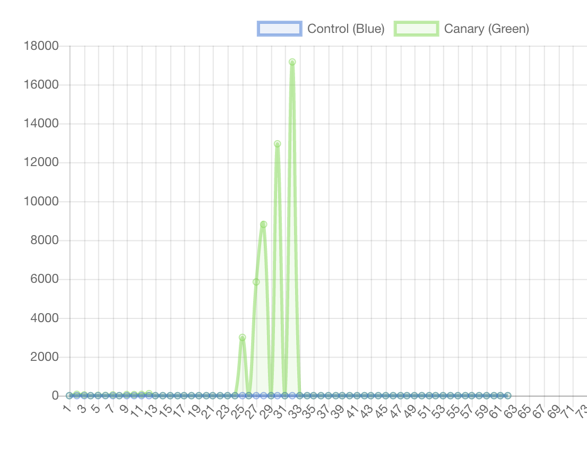

# Chaos

> Chaos is a ladder.

We will explore basic fault and event injection to understand how a simple service responds to different events. This workshop will be a bit more exploratory than some of our other workshops, so this will be a good chance to practice using Docker.



## Setup

Pull the image needed for this workshop.

```bash
bakerx pull chaos CSC-DevOps/Images#Spring2020
```

Clone this repository.

```bash
git clone https://github.com/CSC-DevOps/Chaos
```

Open a terminal inside the directory and install npm packages.

```bash
cd chap
npm install
# One more inner set of packages for dashboard.
cd dashboard
npm install
```

Inside the `Chaos\chap` directory, start the instances:

```bash
cd chap
node index.js up
```

After the instances intialize, start the dashboard service.

```
node index.js serve
```

You should see a dashboard available on your host machine http://localhost:8080/

## Workshop

### Control and Canary server.

Your control server is running a service with several endpoints, including:

* http://192.168.44.102:3080/ --- displays a simple hello world message.
* http://192.168.44.102:3080/stackless --- computes a medium workload.
* http://192.168.44.102:3080/work --- computes a heavy workload.

Inside the server, three docker containers provide simple node express servers that service these requests.
A reverse-proxy will route uses a simple round robin algorithm to load balance the requests between the containers.

One more endpoint exists for the dashboard:

* http://192.168.44.102:3080/health --- returns basic metrics, including memory, cpu, and latency of services.

Finally, the canary server runs the same exact services, but at http://192.168.66.108/

### Dashboard



The dashboard displays your running infrastructure.  The container's overall health is visualized by a small colored square. 

A line chart displays statistics gathered from the `/health` endpoint. A sidebar menu displays some options for updating the line chart. By clicking the "CPU Load" menu item, you will see the CPU load be compared between the two servers. By clicking the "Latency" menu item, you will see the Latency as calculated by the average time for a request to be serviced between successive health check calls.

You can visualize the effects of traffic on the metrics by visiting the servers, either using a load script, curl command, or siege. For example, you can see a brief spike on the control server by running:

    siege -b -t30s http://192.168.44.102:3080/stackless

The dashboard can fill out with events once left running long enough. By reloading the page or changing metrics, it will reset.

### Tools of Chaos

Inside the /chaos directory, we will find several scripts that will in general cause mayhem, including:

* Burning up the CPU.
* Filling up the disk.
* Dropping random packets.
* Killing processes/containers.

Many of the scripts use traffic control, an advanced tool for setting networking policy. For example, running this will corrupt 50% of network packets.

    tc qdisc add dev enp0s8 root netem corrupt 50%

## Experimentation

While breaking things are fun, we usually want to do so in a principled manner, so we can learn about how our infrastructure handles failure and discover unexpected results.

### Burning up the CPU of a single docker container. 💥

We will conduct a simple experiment where we will induce a heavy CPU load on container within the green canary server. We will then observe differences in metrics across the control and canary server.

##### Adding chaos

Enter the green canary server (`bakerx ssh greencanary`). Then, let's open up a shell within one of the docker containers:

```
docker exec -it app1 sh
```

Then, let's add the [cpu script](chaos/chaos_cpu.sh), and execute it:

```
vi chaos_cpu.sh
chmod +x chaos_cpu.sh
```

Run it.

```
./chaos_cpu.sh
```

##### Observations

Induce load on the green canary server.

    siege -b -t30s http://192.168.66.108:3080/stackless

Now, induce load on the control server.

    siege -b -t30s http://192.168.44.102:3080/stackless

You should see something like this:


*What did we see*? We see a large increase in latency in green canary server, meaning client requests are taking much longer (and may be timing out).

*What have we learned?* Because our round-robin load balancer ignores cpu load, it will continue to route requests to an overloaded instance, who will take much longer in servicing requests. The implication is that we should be mindful of avoiding routing to overloaded instances, which can increase quality of service.


### Network traffic 🚦

Let's start another experiment, were we mess with the network traffic.

Inside our green canary server (`bakerx ssh greencanary`), run the following:

    /bakerx/chaos_network_corruption.sh

Alternatively, you can also directly run:

    tc qdisc add dev enp0s8 root netem corrupt 50%

Task: Try inducing load on the green canary server, now. What does it look like? You might see something like this:



Once you are done, you can reset the connection with:

    /bakerx/chaos_reset.sh


### Killing and starting containers 😵

Inside the green canary server, you can stop the running containers with `docker stop`.
Stop the app1 and app2 containers;

```
docker stop app1 app2
```

Conduct a brief experiment where you compare the performance difference between the control server (with three containers) and the green canary server with 1 container.

You can restore the containers again by starting them up with the following commands:
```
docker run --rm --name app1 -d -p 127.0.0.1:3005:3000/tcp app-server
docker run --rm --name app2 -d -p 127.0.0.1:3006:3000/tcp app-server
# docker run --rm --name app3 -d -p 127.0.0.1:3007:3000/tcp app-server
```

### Squeeze Testing 🔽

By default a Docker container allocates unlimited cpu and memory. Try limiting the available cpu and memory settings with running the container. You can use these parameters:

```
--cpus=".5"
-m 8m
```

Most of these options take a positive integer, followed by a suffix of b, k, m, g, to indicate bytes, kilobytes, megabytes, or gigabytes.

Notice anything interesting?

### Filling disks ⛽

1. Inside one of the containers (e.g., using `docker exec -it app3 sh`), add and run the command to fill the disk: `./fill_disk.sh /fill 2G`.

2. Try to create a file inside another container. What happened?

3. Kill the container and start it again.


🔴 **What surprising fact did you learn?**

## Reflection

How could you extend this workshop to collect more measures and devise an automated experiment to understand which event/failure causes the most problems?
